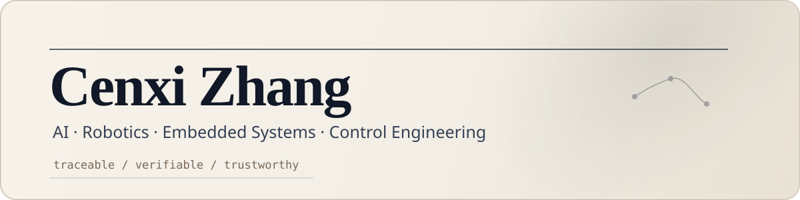

# Cenxi Zhang

**Undergraduate researcher / AI-agent and embedded-control builder**

I work on systems where intelligence has to survive contact with reality: LLM agents that need traceable assumptions, and embedded robots that need stable perception-control loops.

My current direction is simple:

> Make agents more inspectable. Make control systems less mystical. Turn vague tasks into runnable workflows.

<p>
  <a href="mailto:zcx1146@gmail.com">Email</a> ·
  <a href="https://github.com/zcxixixi">GitHub</a> ·
  <a href="application-materials/Cenxi_Zhang_CV_and_Transcript.pdf">CV + Transcript</a> ·
  <a href="application-materials/Cenxi_Zhang_Research_Proposal.pdf">Research Proposal</a>
</p>

## Snapshot

| Area | What I Build |
|---|---|
| **LLM Agents** | tool-augmented workflows, multi-agent orchestration, traceable intermediate states |
| **Agentic Simulation** | scenario systems with explicit evidence, assumptions, validation, and provenance |
| **Embedded AI** | STM32 systems, YOLO/OpenCV perception, real-time communication, control loops |
| **Robotics & Control** | PID, cascaded control, Kalman filtering, ADRC, MATLAB / Simulink validation |

## Current Research Thread

### Harnessed Agentic Simulation

Most agent outputs look fluent. That is not enough.

I am working on a workflow where a decision question is decomposed into inspectable objects:

`DecisionSpec` -> `EvidenceCard` -> `Assumption` -> `WorldSpec` -> `TraceEvent` -> `ReportClaim`

The point is not to make an agent sound confident. The point is to make every final claim traceable to evidence, assumptions, and execution history.

Key questions:

- Can schema validation reduce invalid or incomplete AI-generated scenarios?
- Can provenance traces make long-horizon agent workflows easier to audit?
- Which parts of an agentic workflow actually improve reliability, and which parts are just overhead?

## Selected Work

### Friction-Aware Cooperative ADRC-NN Control

Control research for multi-DOF manipulators under nonlinear friction disturbance.

- Designed a cooperative ADRC + neural-network compensation strategy.
- Implemented ESO-NN simulation workflow with MATLAB / Simulink / Python.
- Compared PID, pure ADRC, and ADRC-NN variants on tracking accuracy, robustness, and low-speed friction behavior.

### HKUDS nanobot Open-Source Contributions

Open-source work on a lightweight AI-agent framework from HKU Data Intelligence Laboratory.

- Contributed PRs related to external communication capability, CLI reliability, CJK text workflows, and command interaction flow.
- Worked with Python, CLI design, IMAP / SMTP integration, and user-agent communication.
- Project: [HKUDS/nanobot](https://github.com/HKUDS/nanobot)

### Embedded Vision Measurement and Control System

National Undergraduate Electronics Design Contest project.

- Led a three-member team in a four-day, three-night closed contest.
- Built a full-stack embedded vision measurement and control system from scratch.
- Integrated YOLO recognition, OpenCV geometric measurement, camera calibration, perspective transformation, and serial communication.
- Result: **National First Prize**, **3rd in Shandong Province**, **national top 1%**.

### LLM-Based Intelligent Wheel-Legged Robot

Embedded Chip and System Design Competition project.

- Integrated LLM-driven interaction logic with gesture recognition, light perception, IoT control, STM32 modules, and LVGL UI.
- Built real-time hardware interaction modules for wheel-legged mobility and sensor integration.
- Result: **First Prize, East China Division**.

### 32-Hour AI Training Course

Designed and presented an AI course for **93 master's students**.

- Covered neural networks, CNNs, NLP, Transformers, LLM agents, generative models, and applied AI systems.
- Built notebooks, datasets, assignments, and code examples from math intuition to implementation.
- Materials: [ai-course](https://github.com/zcxixixi/ai-course)

## Toolkit

```text
AI / Agents        LLM agents, multi-agent workflows, RAG concepts, LangGraph, tool use
Programming        Python, C, MATLAB, TypeScript, FastAPI, Next.js, GitHub Actions
Embedded           STM32, embedded C, serial communication, sensors, real-time debugging
Control            PID, cascaded control, Kalman filtering, ADRC, MATLAB / Simulink
Vision / Robotics  YOLO, OpenCV, camera calibration, geometric measurement, actuation
```

## Honors

- National First Prize, National Undergraduate Electronics Design Contest, 2025
- First Prize, Embedded Chip and System Design Competition, East China Division, 2025
- Third Prize, Lanqiao Cup National Finals, Embedded Design and Development, 2025
- First Prize, National Undergraduate Electronics Design Contest, Shandong Division, 2024
- First-Class Scholarship for Outstanding Students, Qingdao University of Technology, 2024, 2025, 2026

## Application Materials

For forms asking for **"CV and Transcripts combined in one PDF"**, use:

[Cenxi_Zhang_CV_and_Transcript.pdf](application-materials/Cenxi_Zhang_CV_and_Transcript.pdf)

Additional materials:

- [Research Proposal](application-materials/Cenxi_Zhang_Research_Proposal.pdf)
- [Full Packet: CV + Transcript + Research Proposal](application-materials/Cenxi_Zhang_CV_Transcript_Research_Proposal.pdf)
